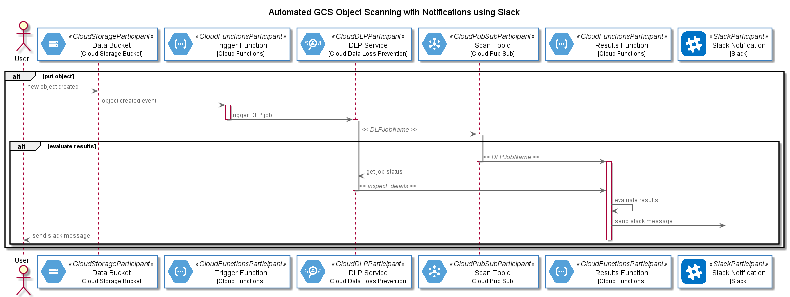

# Really Simple Terraform to Automate DLP scans of Newly Created Objecst in Google Cloud Storage with Notifications via Slack

This module is used to package and deploy a Google Cloud Function to send notifications to Slack for events against a Cloud Storage bucket

The complete process is described here:

The full article is available at [Automated GCS Object Scanning Using DLP with Notifications Using Slack](https://cloudywithachanceofbigdata.com/automated-gcs-object-scanning-using-dlp-with-notifications-using-slack/)

> Requires input variables for *resource* (Cloud Storage bucket to monitor), *min_likelihood* (liklihood of the object containing a specified DLP info type) and *slack_webhook_url*

More information on the Google Cloud DLP service is available at [Google Cloud DLP](https://cloud.google.com/dlp)